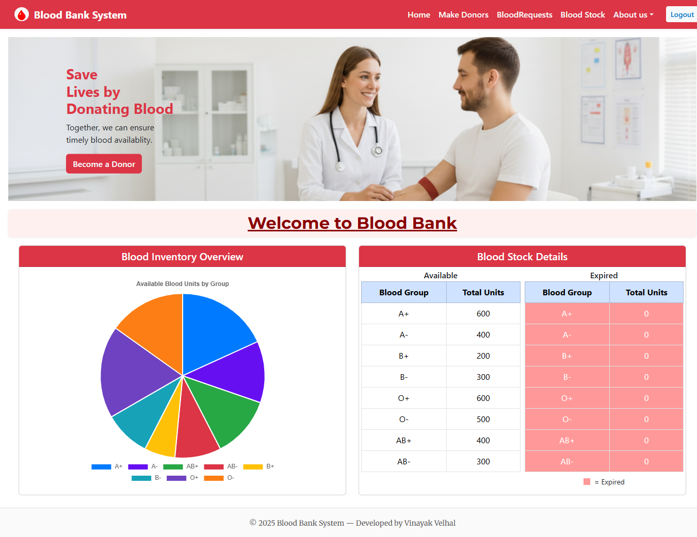
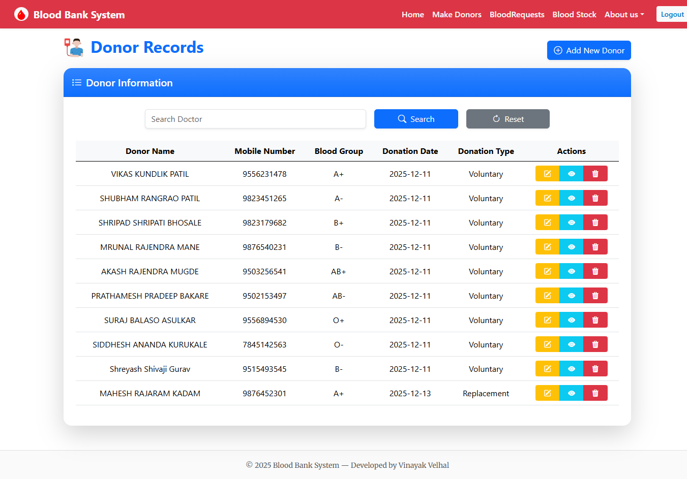
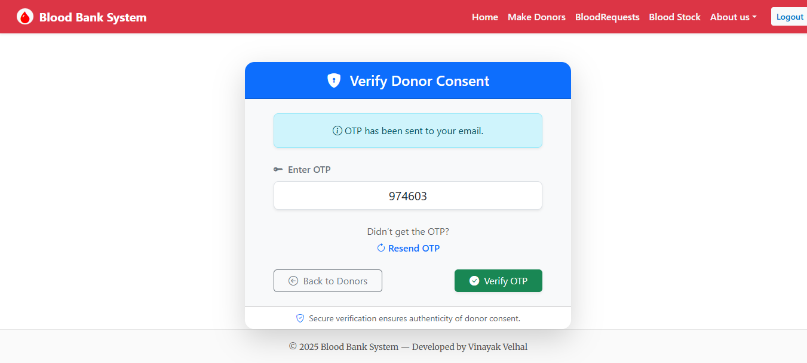
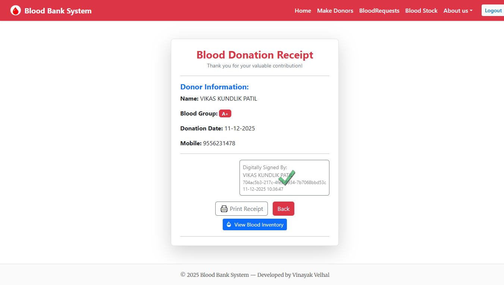
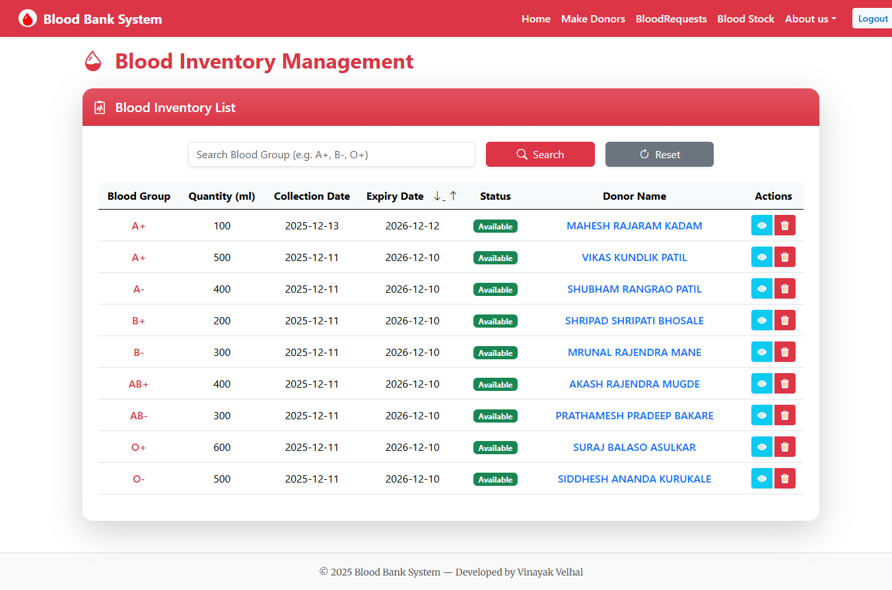
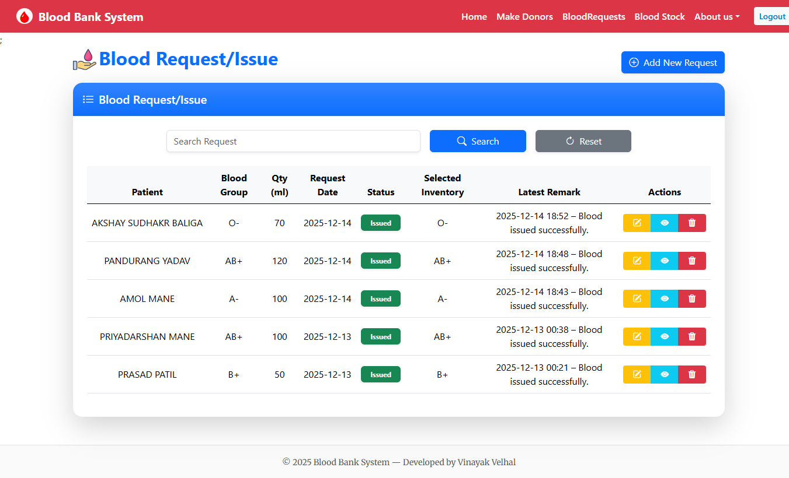
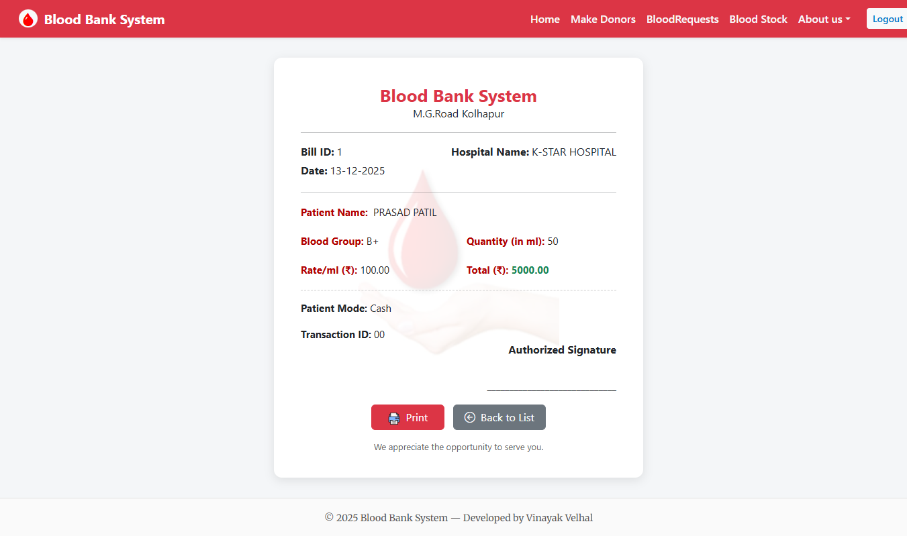

## 📌 Blood Bank Management System

A web-based application developed to manage blood donors, blood inventory, blood requests, and donation records efficiently.  
This project is built using **ASP.NET Core MVC** with **Entity Framework Core** and **SQL Server**.

---

## 🚀 Technologies Used

- **Frontend:** HTML, CSS, Bootstrap, JavaScript  
- **Backend:** ASP.NET Core MVC, C#  
- **Database:** SQL Server  
- **ORM:** Entity Framework Core  
- **Email Service:** SMTP (OTP-based consent verification)  
- **Version Control:** Git & GitHub  

---

## ✨ Key Features

- Donor registration and management  
- Blood inventory tracking (available & expired blood)  
- Blood request and issue management  
- Donation record management  
- Consent verification using OTP via email  
- Search and display records  
- Secure configuration using `appsettings.json`  
---

## 🔐 Security & Configuration

- Sensitive data (SMTP credentials, connection strings) are **not hard-coded**
- Secrets are managed using:
  - `appsettings.Development.json` (local)
  - Environment variables / Azure App Settings (production)

---

## 🛠️ How to Run the Project Locally

1. Clone the repository  
2. Open the solution in **Visual Studio**  
3. Configure:
   - SQL Server connection string
   - SMTP credentials in `appsettings.Development.json`
4. Apply migrations / update database  
5. Run the project

---

## 📂 Project Structure

- **Controllers** – Handles application logic  
- **Models** – Entity classes 
- **Views** – Razor views (UI)  
- **wwwroot** – Static files (CSS, JS, Bootstrap)  

---

## 🖼️ Screenshots

> Screenshots of the application UI and features

### Dashboard

### Donation Records

### Donor Consent Verification

### Donation Receipt

### Blood Inventory Management

### Blood Request/Issue Management

### Blood Request Bill

---

## 🎯 Purpose of the Project

This project was developed as an **internship / learning project** to gain hands-on experience in:
- ASP.NET Core MVC architecture  
- Database-driven web applications  
- Real-world features like OTP verification and email integration  
- GitHub version control and deployment readiness  

---

## 👤 Author

**Vinayak Umesh Velhal**  
ASP.NET Core MVC Developer (Fresher)

---

## 📄 License

This project is for **educational and learning purposes only**.
